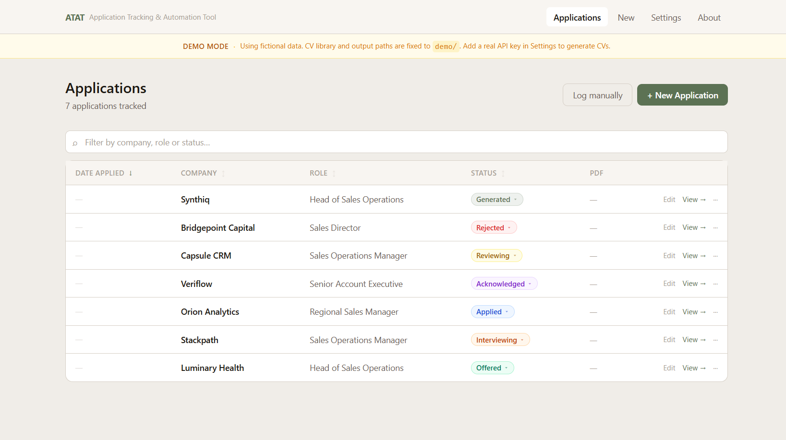
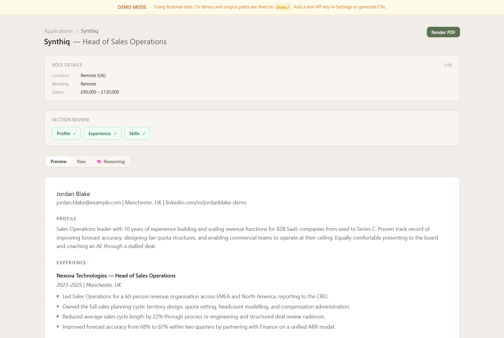
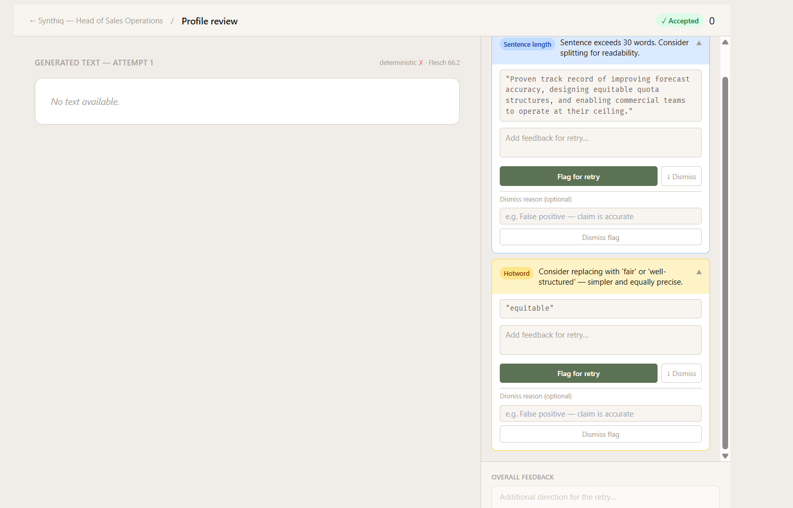

# ATAT — Application Tracking and Automation Tool

A personal applicant tracking system with an LLM-powered CV generation pipeline.
Paste a job description, get a tailored CV out. Built for people who treat their
job search the way they'd treat any other systems problem.

## Screenshots

<table>
  <tr>
    <td align="center">
      
      <sub><b>Application tracker</b> — sortable list with status, salary and role details</sub>
    </td>
    <td align="center">
      
      <sub><b>Application detail</b> — CV preview, role metadata and section review</sub>
    </td>
    <td align="center">
      
      <sub><b>Human-in-the-loop review</b> — judge flags with dismiss and action workflow</sub>
    </td>
  </tr>
</table>

## Architecture

```
cv-library/     ← separate private repo — experience data, personas, skills
atat/           ← this repo
  api/          ← FastAPI backend — applications, generation, review, render
  web/          ← Next.js frontend — tracker UI, CV preview, section review
  pipeline/     ← LLM tailorer, PDF renderer, judge pipeline
  db/           ← SQLite schema and migrations
  demo/         ← fictional seed data and cv-library for demo mode
  prompts/      ← LLM system prompts
  output/       ← generated CVs (gitignored)
```

## Setup

### Prerequisites
- Python 3.11+
- Node.js 18+
- A clone of your cv-library repo
- An Anthropic or OpenAI API key
- [Typst](https://typst.app/) for PDF rendering
- Poppins font TTFs in `fonts/` (see below)

### Installation

```bash
git clone https://github.com/yourusername/atat.git
git clone https://github.com/yourusername/cv-library.git  # skip for demo mode

cd atat
python -m venv .venv
source .venv/bin/activate  # or .venv\Scripts\activate on Windows
pip install -r requirements.txt

cd web && npm install && cd ..

cp .env.example .env
# Edit .env — set CV_LIBRARY_PATH and your API key
```

### Fonts

Download the [Poppins](https://fonts.google.com/specimen/Poppins) family and place
the TTF files into `fonts/`. The PDF renderer expects them at that path.

### Running

```bash
# Development (two terminals)
./dev.sh          # starts FastAPI on :8000
cd web && npm run dev   # starts Next.js on :3000

# Production
./start.sh        # builds and starts both
```

## Demo Mode

ATAT ships with a fictional dataset for portfolio and demo use. To activate:

1. Set `DEMO_MODE=true` in `.env`
2. Run the seed script: `python -m demo.seed`
3. Restart both servers

The app will use `demo/atat.db` and `demo/cv-library/` instead of your real data.
A banner is shown in the UI to make the demo context clear. Path settings are locked
while demo mode is active.

## CV Library

ATAT expects a cv-library at the path set in `CV_LIBRARY_PATH`. The library follows
this structure:

```
cv-library/
  experience/     ← one .md file per role
  personas/       ← persona definitions used for LLM classification
  skills/
    skills.md
  meta/
    meta.md       ← name, contact info
```

See `demo/cv-library/` for a complete worked example.

## Roadmap

- [x] LLM-powered CV generation with extended thinking
- [x] Typst → PDF rendering with ATS metadata
- [x] Web-based application tracker
- [x] Tiered judge pipeline (deterministic → LLM → human-in-the-loop)
- [x] Section versioning with generational lineage
- [x] Demo mode with fictional seed data
- [ ] Cover letter generator
- [ ] Application question support
- [ ] Interview prep
