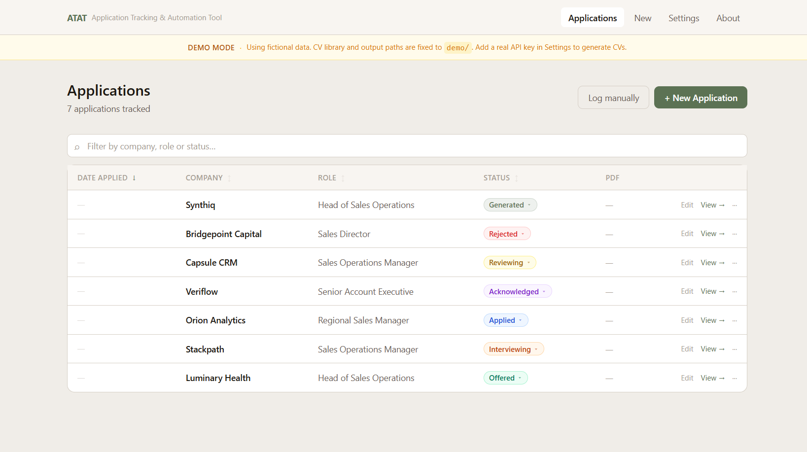
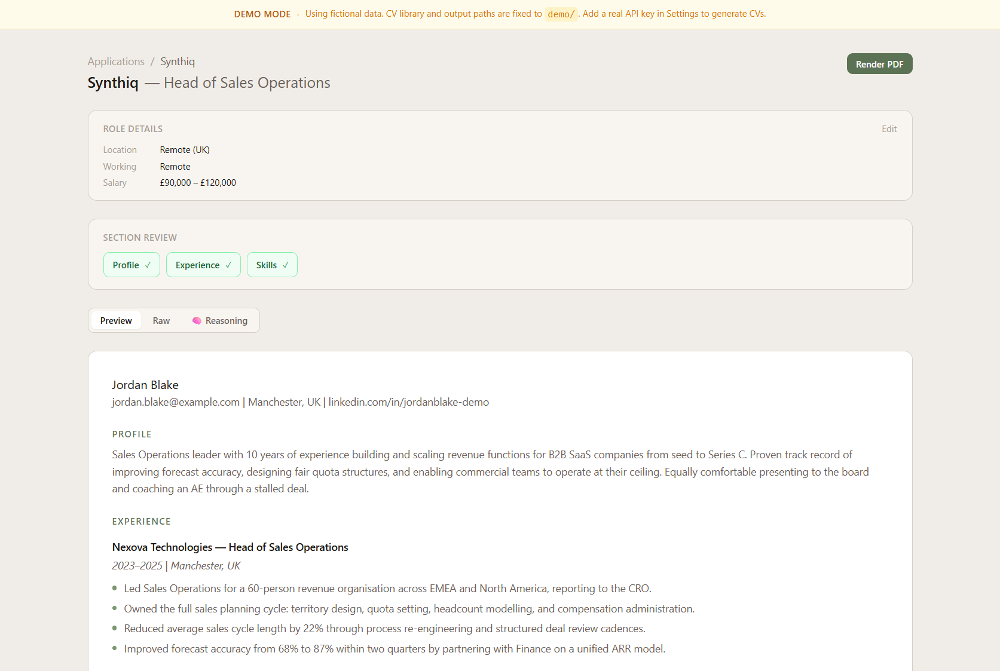
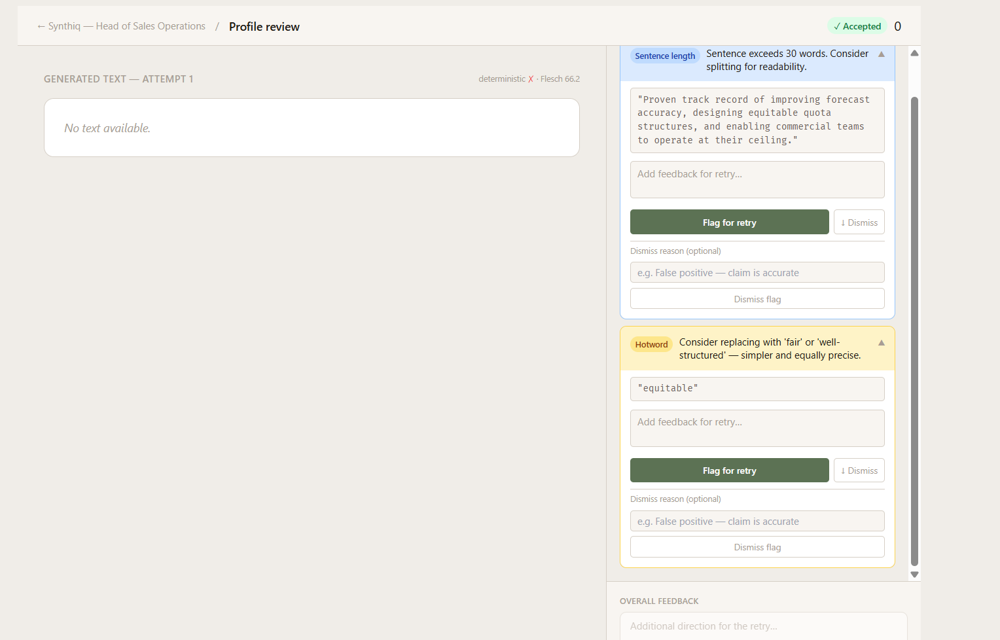

# ATAT — Application Tracking and Automation Tool

A personal applicant tracking system with an LLM-powered CV generation pipeline.
Paste a job description, get a tailored CV out. Built for people who treat their
job search the way they'd treat any other systems problem.

## Screenshots

<table>
  <tr>
    <td align="center">
      
      <sub><b>Application tracker</b> — sortable list with status, salary and role details</sub>
    </td>
    <td align="center">
      
      <sub><b>Application detail</b> — CV preview, role metadata and section review</sub>
    </td>
    <td align="center">
      
      <sub><b>Human-in-the-loop review</b> — judge flags with dismiss and action workflow</sub>
    </td>
  </tr>
</table>

## Architecture

```
cv-library/     ← separate private repo — experience data, personas, skills
atat/           ← this repo
  api/          ← FastAPI backend — applications, generation, review, render
  web/          ← Next.js frontend — tracker UI, CV preview, section review
  pipeline/     ← LLM tailorer, PDF renderer, judge pipeline
  db/           ← SQLite schema and migrations
  mcp_server/   ← MCP server — lets an agent drive ATAT directly (see below)
  demo/         ← fictional seed data and cv-library for demo mode
  prompts/      ← LLM system prompts
  output/       ← generated CVs (gitignored)
```

## Setup

### Prerequisites
- Python 3.11+
- Node.js 18+
- A clone of your cv-library repo
- An Anthropic or OpenAI API key
- [Typst](https://typst.app/) for PDF rendering
- Poppins font TTFs in `fonts/` (see below)

### Installation

```bash
git clone https://github.com/yourusername/atat.git
git clone https://github.com/yourusername/cv-library.git  # skip for demo mode

cd atat
python -m venv .venv
source .venv/bin/activate  # or .venv\Scripts\activate on Windows
pip install -r requirements.txt

cd web && npm install && cd ..

cp .env.example .env
# Edit .env — set CV_LIBRARY_PATH and your API key
```

### Fonts

Download the [Poppins](https://fonts.google.com/specimen/Poppins) family and place
the TTF files into `fonts/`. The PDF renderer expects them at that path.

### Running

```bash
# Development (two terminals)
./dev.sh          # starts FastAPI on :8000
cd web && npm run dev   # starts Next.js on :3000

# Production
./start.sh        # builds and starts both
```

## Demo Mode

ATAT ships with a fictional dataset for portfolio and demo use. To activate:

1. Set `DEMO_MODE=true` in `.env`
2. Run the seed script: `python -m demo.seed`
3. Restart both servers

The app will use `demo/atat.db` and `demo/cv-library/` instead of your real data.
A banner is shown in the UI to make the demo context clear. Path settings are locked
while demo mode is active.

## CV Library

ATAT expects a cv-library at the path set in `CV_LIBRARY_PATH`. The library follows
this structure:

```
cv-library/
  experience/     ← one .md file per role
  personas/       ← persona definitions used for LLM classification
  skills/
    skills.md
  meta/
    meta.md       ← name, contact info
```

See `demo/cv-library/` for a complete worked example.

## MCP Server

`mcp_server/` exposes ATAT to an MCP client (Claude Desktop, Claude Code, Cowork)
as a set of tools, so an agent can browse your application history, generate and
review CVs, and mine past feedback for patterns — without going through the web UI.
It imports `db/` and `pipeline/` directly (same SQLite file, same generation code
as the FastAPI app), rather than proxying HTTP calls.

```bash
pip install -r requirements.txt   # includes the `mcp` package
cp .mcp.json.example .mcp.json    # then add it to your MCP client's config
```

### Tool groups

- **Applications** — `list_applications`, `get_application`, `get_cv_markdown`,
  `get_reasoning`, `get_events`, `get_dates`, `log_date`, `add_note`,
  `update_application`, `update_cv_markdown`, `render_cv`
- **Generation pipeline** — `list_sections`, `get_section_chain`, `get_report`,
  `run_judges`, `accept_report`, `regenerate_section`
- **Cover letters** — `get_cover_letter`, `generate_cover_letter`,
  `update_cover_letter`, `render_cover_letter`
- **Application questions** — `list_questions`, `add_question`,
  `delete_question`, `generate_answers`, `update_answer`, `submit_answer_feedback`
- **Intake** — `scrape_job_url`, `submit_job`, `find_by_source_url`,
  `get_recent_notes`
- **Submission** — `get_application_bundle`, `record_submission`
- **Insights** — `get_prompt_signals`, `get_exclusion_patterns`,
  `get_success_stats`, `search_applications`, `get_flag_history`,
  `get_reference_cvs`
- **cv-library** — `list_experience_entries`, `get_experience_entry`,
  `list_personas`, `get_persona`, `get_skills`, `get_meta`, `search_library`
- **Prompt tuning** — `get_personal_additions`, `add_personal_rule`,
  `update_personal_additions`
- **Meta** — `get_guide`

`render_cv` matters after any `accept_report`/`regenerate_section` call — those
update `cv.md` but don't auto-render a new PDF (same as the web UI).
`list_sections`' `latest_report` field carries the `report_id` every
generation-pipeline tool needs — `accepted_report_id` is NULL until
something's actually been accepted, so it's the only way to find a report id
right after `submit_job`. The cv-library tools expose the *raw, untailored*
source material (experience entries, personas, skills, contact info) —
distinct from `get_cv_markdown` (one application's already-tailored output)
and `get_reference_cvs` (full CV content from applications that actually got
submitted or further — real working examples, not raw source material).
`add_personal_rule` is the fix for a *recurring* generation mistake — it's
appended to `personal_additions.md`, loaded into every future `submit_job`
call's system prompt, so a correction only has to be made once rather than
re-typed into `generation_notes` on every CV. `get_guide` (and the
equivalent `atat://guide` resource, for clients that support MCP resources)
is a fetchable workflow-sequencing and valid-value glossary that doesn't
belong to any single tool's docstring — call it first in a new session.

### Working a Todoist queue

ATAT's MCP server intentionally has no Todoist or browser tools of its own —
that orchestration lives in the agent, which can hold multiple MCP servers at
once. A typical setup: a Todoist MCP server, ATAT's MCP server, and a browser
tool (e.g. `claude-in-chrome`), all available to the same session. The agent then:

1. Pulls the next job ad from a Todoist project, respecting your priority order.
2. Calls `scrape_job_url`; if the page won't yield clean text (JS-rendered board,
   login wall), falls back to the browser tool to extract the JD manually.
3. Checks `get_prompt_signals` / `get_success_stats` / `search_applications` for
   relevant history before generating.
4. Calls `submit_job`, then inspects flags via `get_report` — accepts clean
   sections automatically, or leaves the Todoist task open with a comment when
   something needs a human call.
5. Generates the cover letter and question answers, then calls
   `get_application_bundle` and hands it to the browser tool to fill out the
   actual application form.
6. Calls `record_submission`, then completes the Todoist task.

Whether the agent submits fully autonomously or pauses for review before the
final click is a matter of how you operate the agent (Claude Desktop vs. Cowork,
system prompt, etc.) — not something the ATAT tools enforce.

## Roadmap

- [x] LLM-powered CV generation with extended thinking
- [x] Typst → PDF rendering with ATS metadata
- [x] Web-based application tracker
- [x] Tiered judge pipeline (deterministic → LLM → human-in-the-loop)
- [x] Section versioning with generational lineage
- [x] Demo mode with fictional seed data
- [ ] Cover letter generator
- [ ] Application question support
- [ ] Interview prep
- [x] MCP server for agent-driven generation, review, and pattern mining
